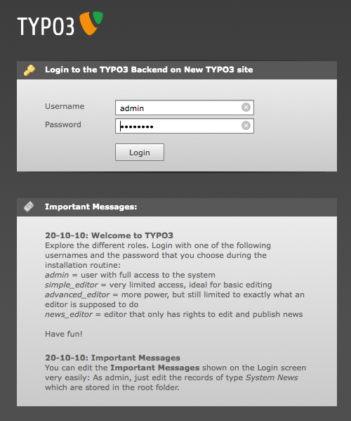

.. ==================================================
.. FOR YOUR INFORMATION
.. --------------------------------------------------
.. -*- coding: utf-8 -*- with BOM.

.. include:: ../Includes.txt


.. NOTE: the following line is a label for the "Next steps" section.
   It must be followed by a blank line

.. _chapter1:

Chapter 1
---------

Here begins the manual proper... This sample chapter contains many examples of the
markup that can be used in the TYPO3 documentation.

.. _inline-markup:

Inline markup
^^^^^^^^^^^^^

This is *some emphasis* and this is **strong emphasis**.
There can also be so-called ``inline literals`` rendered in monospaced font.

To write an asterisk, you have to escape it \* (with a backslash \\).
The same is true for the back-tick \`, the underscore \_, the vertical bar \| and the backslash \\ itself.

To refer to files, use the ``:file:`` text role, like: "The TYPO3 source is usually
named :file:`typo3_src-{x}.{y}.{z}`". Look at the source code to see how curly braces
can be used within the ``:file:`` role to highlight replaceable parts.

.. _admonitions:

Admonitions
^^^^^^^^^^^

Here are examples of the various call-out boxes which may be used in
the document.

Notes of type ".. note::" are remarks that should stick out a bit.
They are breaking the normal reading flow but are of low importance. No real
problem should arise if the reader skips over a "note".
Notes are well suited for outlining the bigger picture and giving pointers
to further information.

.. note::

   Don't give up! You are not the only one who is struggling with
   this in the beginning!

Use ".. important::" when something is difficult or non
obvious. It's something the reader should not forget, but that
is not critical. Things should still be in a recoverable state
if important stuff is forgotten.

.. important::

   Make sure PHP can find ``openssl.cnf``. Otherwise ``rsaauth``
   may fail even though it's telling you "Installation ok"!
   And there will be no error message!


Annotations of type ".. caution::" are the most important. Not following
such recommendations may result in an unrecoverable failure. As a manual
editor you should use this annotation very rarely.

.. caution::

   **Warning**!

   This is for the courageous only. Do this on your own risk!
   *Never* do this on a production system. And - do we
   need to say that? - make sure you have a *tested* backup!


Tips are meant to help readers do something in a more simple way
or may point to helpful resources like cheat sheets.
Use ".. tip::" for this.

.. tip::

   You don't need PHP to create a link to a page. Use TypoScript and the 'typolink'
   property instead ::

      10 = TEXT
      10.value = Go to that page!
      10.typolink.parameter = 10

.. todo::

   We can explain this todo directive. There is a commandline switch
   that decides wheter todos are kept in output. And a list of all
   todos can be inserted in the output. See: ->Google ->"Sphinx
   directive todo"


.. _code-samples:

Code samples
^^^^^^^^^^^^

Here's how a code sample looks like::

   function doSomething() {
       $a = 1;
       if ($a = 2) {
           $a = 3;
       }
       return $a;
   }

By default all code samples will be considered to be PHP for the purpose
of syntax highlighting, since we declare ``.. highlight:: php`` in the
general "Includes.txt" file.

Using the ``.. code-block::`` directive, it is possible to specify a different
language for syntax highlighting. Look at the source code to see the options
used for activating line numbers and highlighting some lines in the sample.

.. code-block:: javascript
   :linenos:
   :emphasize-lines: 2,2

   function someJS() {
       alert('foo!');
   }

Here is the list of supported languages: http://pygments.org/languages/.
Note that there's no support for TypoScript (yet).

.. todo::
   Obviously, this will be more convicing when syntax highlighting actually works.

Inline code samples should use the ``:code:`` text role, as in :code:`$x = $a + $b;`.
Our general "Includes.txt" file also defined ``:typoscript:``, ``:ts:`` and ``:php:``
roles, which all inherit from ``:code:``. A markup like :typoscript:`lib.foo = TEXT`
gets rendered as:

.. code-block:: html

   <tt class="code typoscript docutils literal">
       <span class="pre">lib.foo</span>
       <span class="pre">=</span>
       <span class="pre">TEXT</span>
   </tt>

The role's name is simply used as a class name. In the case of ``:ts:``, the class
name is forced to "typoscript" (see "Includes.txt").


.. _tables:

Tables
^^^^^^

There are different ways of defining tables in ReST. All can be used freely, as seems fit.

Here is a sample table that uses ReST's 'simple table' format:

==============  =============  ==========================================================  =======
Property        Data type      Description                                                 Default
==============  =============  ==========================================================  =======
allWrap         wrap /stdWrap  Wraps the whole item
wrapItemAndSub  wrap /stdWrap  Wraps the whole item and any submenu concatenated to it.
==============  =============  ==========================================================  =======


Here is a sample table that uses ReST's 'grid table' format:

+----------------+---------------+---------------------------------+-------------+
| Property       | Data type     | Description                     |  Default    |
+================+===============+=================================+=============+
| allWrap        | wrap /stdWrap | Wraps the whole item            |             |
+----------------+---------------+---------------------------------+-------------+
| wrapItemAndSub | wrap /stdWrap | Wraps the whole item and        |             |
|                |               | any submenu concatenated to it. |             |
+----------------+---------------+---------------------------------+-------------+


Here is a sample table that uses the 't3-field-list-table' directive:

.. t3-field-list-table::
 :header-rows: 1

 - :Property,20:    Property
   :Data type,20:   Data type
   :Description,50: Description
   :Default,10:     Default

 - :Property:    allWrap
   :Data type:   wrap / stdWrap
   :Description: Wraps the whole item

 - :Property:    wrapItemAndSub

   :Data type:   wrap / stdWrap

   :Description:
         Wraps the whole item and
         any submenu concatenated to it.


Here is a sample table in 'definition list' format. We are using that as
a workaround as long as the planned 'field-list-table' method isn't available.
Each 'table-row' container corresponds to on row of the table. Each cell is
represented as a "definition" with the column name and cell contents.

This format must be used - in particular - for references like TypoScript or TSconfig.

.. container:: table-row

   Property
         Name of the property

   Data type
         Data type of the property

   Description
         Description of the property

   Default
         Default value (if any). Leave out entirely if not defined.


.. container:: table-row

   Property
         allWrap

   Data type
         wrap /stdWrap

   Description
         Wraps the whole item


.. container:: table-row

   Property
         wrapItemAndSub

   Data type
         wrap /stdWrap

   Description
         Wraps the whole item and any submenu concatenated to it.


.. container:: table-row

   Property
         subst\_elementUid

   Data type
         boolean

   Description
         If set, all appearances of the string '{elementUid}' in the total
         element html-code (after wrapped in .allWrap} is substituted with the
         uid number of the menu item.

         This is useful if you want to insert an identification code in the
         HTML in order to manipulate properties with JavaScript.


.. container:: table-row

   Property
         RO\_chBgColor

   Data type
         string

   Description
         If property RO is set (see below) then you can set this property to a
         certain set of parameters which will allow you to change the
         background color of e.g. the table cell when the mouse rolls over you
         text-link.

         **Syntax:** ::

            [over-color] | [out-color] | [id-prefix]

         **Example:** ::

            page = PAGE
            page.typeNum = 0
            page.10 = HMENU
            page.10.wrap = <table border=1>|</table>
            page.10.1 = TMENU
            page.10.1.NO {
              allWrap = <tr><td valign=top id="1tmenu{elementUid}" style="background:#eeeeee;">|</td></tr>
              subst_elementUid = 1
              RO_chBgColor = #cccccc | #eeeeee | 1tmenu
              RO = 1
            }

         This example will start out with the table cells in #eeeeee and change
         them to #cccccc (and back) when rolled over. The “1tmenu” string is a
         unique id for the menu items. You may not need it (unless the same
         menu items are more than once on a page), but the important thing is
         that the id of the table cell has the exact same label before the
         {elementUid} (red marks). The other important thing is that you DO set
         a default background color for the cell with the style-attribute (blue
         marking). If you do not, Mozilla browsers will behave a little strange
         by not capturing the mouseout event the first time it's triggered.

The number of columns may vary according to the needs.

.. _lists:

Lists
^^^^^

And here's a bullet list:

- item 1

- item 2 is longer and will be on several lines, so that we can be sure
  that it looks okay when it runs over several lines.

- item 3

Next is a numbered list:

#. this is the first step to take. It is important to take the first step
   first and not second, otherwise it is not a first step anymore.

#. step 2

#. step 3

Finally a definition list:

A word
  And its definition.

*Another* word
  And another definition. Note that it's possible to have inline markup
  inside the term.

.. _links:

Links
^^^^^

External links can be just a URL like http://typo3.org/\. In general
you can escape any character with a backslash and it will default to
itself. Therefore writing "\." in the example makes it clear that the
dot does not belong to the URL.

To give it some link text write
`TYPO3 community web site <http://typo3.org/>`_
for example. The latter works for relative links as well as in `see the
folder <.>`_

Mailto links work fine too: documentation@typo3.org or `Documentation
Team <documentation@typo3.org>`_

It is also possible to link to Forge issues using
``:forge:`40507```. This will render as :forge:`40507`.

It can be nice to use `anonymous links`__. This is a feature__ of the
Docutils__\. Look at the source code to see how the links destinations
are defined.

.. Here we provide the three destinations for the
   three anonymous links of the above text that are still "open" and
   are waiting for definition:

__ http://docutils.sourceforge.net/docs/ref/rst/restructuredtext.html#anonymous-hyperlinks
__ http://en.wikipedia.org/wiki/Feature
__ http://docutils.sourceforge.net/

.. _internal-links:

Internal links
""""""""""""""

Inside a given file, links can be made using references to existing
labels. Here is a link to chapter1_. Doing so is not recommended
though because this will only work within the same file.

The recommended way for linking in your documentation project is to
use the ``:ref:`...``` textrole. This is the Sphinx way of linking
which will work within the whole documentation project. You don't have
to care about which file the destination actually is in.

Here is a link to :ref:`next-steps` written as ``:ref:`next-steps```.
In this case the linked text will
be the one associated with the label 'next-steps'. In this
case it is the text of the section title the label stands for.

You can apply you own link text too. Here is a link to
:ref:`See these steps <next-steps>` written as
``:ref:`See these steps <next-steps>```.

.. tip::
   Labels have to be unique in their universe. If a link isn't rendered
   as a link it is either not defined or not unique.


.. todo::
   See ... on how to associate another text to a label if that isn't
   preceeding a section title.

.. _cross-linking:

Cross-linking
"""""""""""""

It is also possible to link to other manuals. This is of course the most
interesting linking feature. Such links are similar to the ones described
above, with an added project key used in the reference. Example:

Here is a link to :ref:`t3api:extension-install` written as
``:ref:`t3api:extension-install```. It is pointing to the **label** "extension-install"
in a different documentation project identified by **key** "t3api". The linked text
will be the one that's associated with the label 'extension-install'.

Here too it is possible to use one's own link text. Here is a link to
:ref:`the extension installation process <t3api:extension-install>`
written as ``:ref:`the extension installation process <t3api:extension-install>```.

How are keys defined? The keys are part of the configuration of a tool called
Intersphinx. This configuration is made in Python and is normally part of the
"conf.py" file of each documentation project. In order to simplify cross-linking
to all official manuals, predefined keys are available for all official manuals.
They can be found in the "GlobalSettings.yml" file of the RestTools project.

Here is the list for reference:

=============  ====================================
Key            Manual
=============  ====================================
t3maintenance  Maintenance Guide
t3api          Core APIs
t3cgl          Core Coding Guidelines
t3editors      Tutorial for Editors
t3fal          File Abstraction Layer Reference
t3start        Getting Started Tutorial
t3inside       Inside TYPO3
t3install      Installation Guide
t3l10n         Frontend Localization Guide
t3security     Security Guide
t3services     Services Reference
t3skinning     Skinning API
t3tca          TCA Reference
t3ts45         TypoScript in 45 Minutes
t3tsconfig     TSconfig Reference
t3tsref        TypoScript Reference
t3tssyntax     TypoScript Syntax and in-depth Study
=============  ====================================

.. tip::
   Every official manual has a "start" label which you can use to create
   a link to the manual's "cover" page. As in: refer to :ref:`t3api:start` for
   a description to TYPO3's main APIs.


.. _images:

Images
^^^^^^

It is recommended to use the "figure" directive as it supports captions and legends, plus figures can be cross-referenced. It is also recommended to set the ":alt:" property.



   TYPO3 Backend login screen

